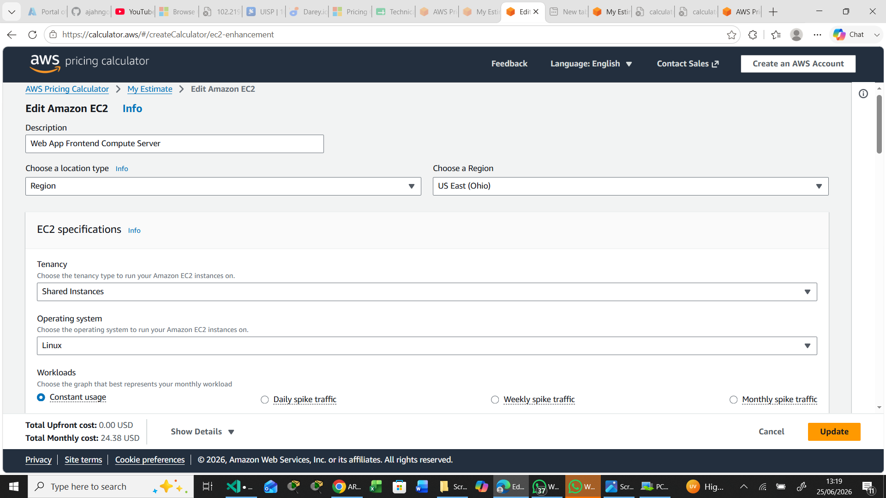
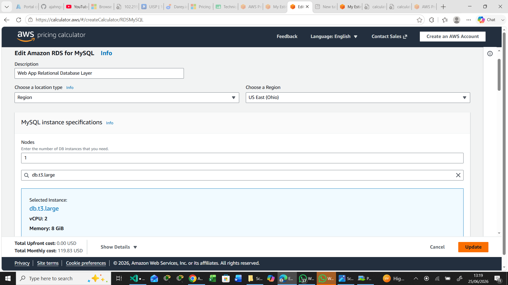
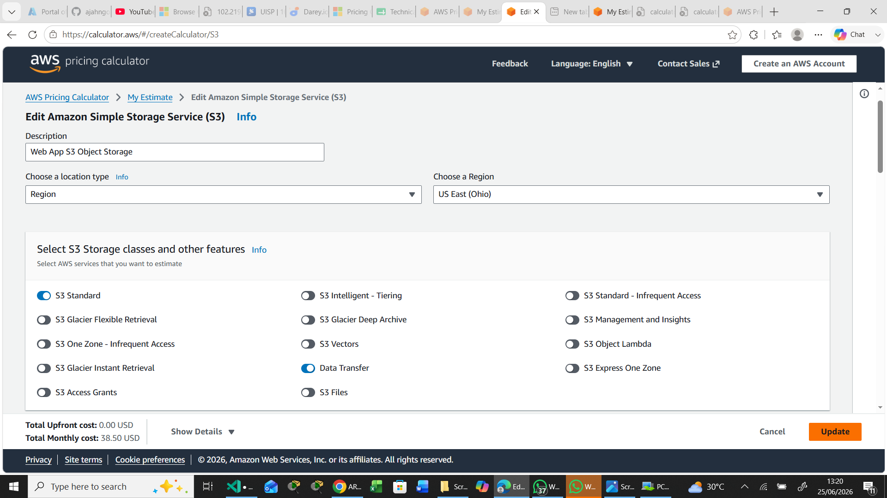
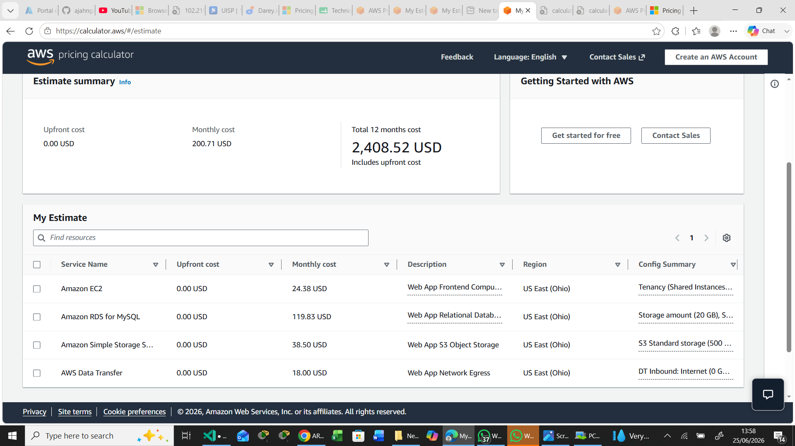
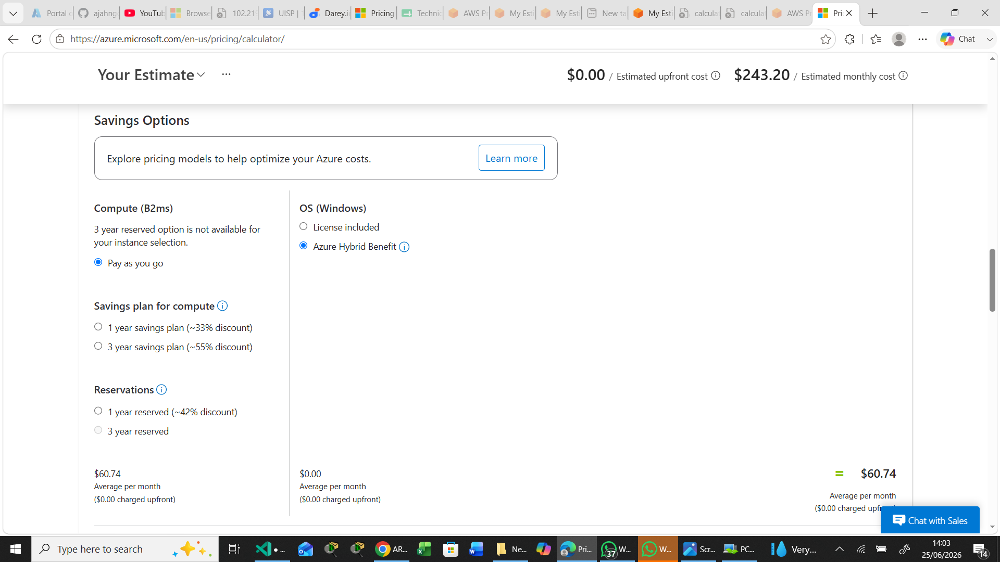
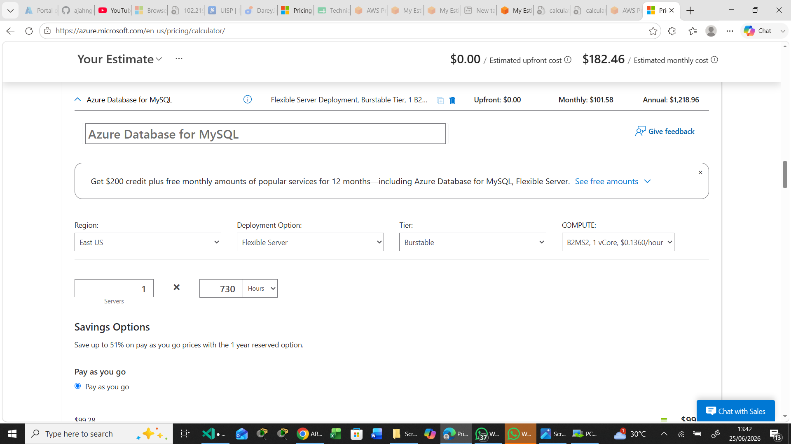
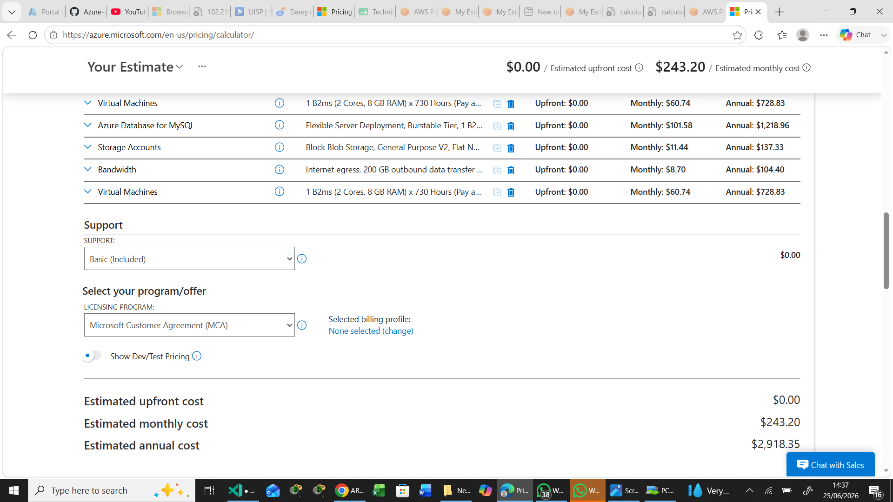

# Azure-vs-AWS-Cost-Comparison-Learning-Program
## Comprehensive Cloud TCO & Regional Price Analysis Report
## 3-Tier Production Web Application Architecture (AWS vs. Microsoft Azure)

This engineering report presents a detailed Total Cost of Ownership (TCO) financial model, service equivalency mapping, and regional pricing analysis comparing Amazon Web Services (AWS) and Microsoft Azure. This evaluation analyzes the cost drivers across diverse geographical operational zones, licensing nuances, and platform discount structures to guide institutional architectural deployment decisions.

---

##  Verified Public Estimate Links
* **AWS Pricing Calculator Total Estimate Workspace:** [View Verified AWS Estimate](https://calculator.aws/#/estimate?id=63d3f90d031e118865314669f280c0e712b2bf43)
* **Azure Pricing Calculator Total Estimate Workspace:** [View Verified Azure Estimate](https://azure.com/e/d8aec1c6fbff4731aa02360ebd55002f)

---

## 1. Application Specifications & Architectural Baseline (Task 1)

To ensure a rigid, scientifically fair baseline comparison, an identical infrastructure configuration was modeled. The benchmark workload simulates a standard monolithic 3-tier production stack deployed under stable conditions:

* **Compute Tier:** 2 vCPUs, 8 GB RAM nodes running continuously (730 hours/month) to handle active application runtimes.
* **Database Tier:** Managed Relational MySQL Engine configured with 2 vCPUs, 8 GB RAM, paired with 20 GB of dedicated performance-backed storage capacity.
* **Object Storage Tier:** 500 GB of standard persistent storage allocation reserved for static application assets, automated daily backups, and user-generated media uploads.
* **Network Capacity (Data Egress):** 200 GB per month of outbound network transfer routed out from the internal cloud network to the public internet.

---

## 2. Platform Navigation, Pricing Models & Assumptions

### AWS Estimating Methodology
* **Navigation Process:** Sourced through the AWS Pricing Calculator. Individual service modules (`Amazon EC2`, `Amazon RDS for MySQL`, `Amazon S3`) were explicitly provisioned.
* **Pricing Models & Assumptions:** Evaluated under a standard Pay-As-You-Go model. Calculations incorporate the standard AWS global account allocation tier (e.g., the base 100 GB regional internet data transfer allowance), applying standard multi-tenant operational rates on the remaining infrastructure footprints.

### Azure Estimating Methodology
* **Navigation Process:** Formulated via the Azure Pricing Calculator by generating custom resource cards for `Virtual Machines`, `Azure Database for MySQL Flexible Server`, `Storage Accounts`, and `Bandwidth`.
* **Pricing Models & Assumptions:** Modeled using Pay-As-You-Go pricing. Operating systems are calculated as clean Linux nodes to establish an exact hardware match against AWS. Totals are derived dynamically on an hourly calculation matrix assuming standard 730-hour billing periods.

---

## 3. Service Equivalency Mapping

To achieve structural parity across fundamentally different cloud abstraction layers, services were mapped based strictly on performance capacity rather than naming conventions:

| Architectural Tier | AWS Resource Unit Selection | Azure Resource Unit Selection | Technical Performance Alignment Rationale |
| :--- | :--- | :--- | :--- |
| **Compute layer** | **EC2 (`t4g.large`)** | **Virtual Machine (`Standard_B2ms`)** | Both provide exactly 2 vCPUs and 8 GB RAM configurations. AWS utilizes custom ARM64-based Graviton architecture, while Azure provides x86 general-purpose burstable performance profiles. |
| **Database Layer** | **RDS for MySQL** | **Azure DB for MySQL (Flexible Server)** | Both abstract database administration, utilizing a Single-AZ deployment engine matching compute metrics (2 vCPUs / 8 GB RAM) combined with 20 GB underlying storage. |
| **Object Storage** | **S3 Standard Tier** | **Storage Account (Blob Hot Tier)** | Standard target storage categories utilizing locally redundant data storage mechanics to securely store hot static media. |
| **Network Layer** | **Data Transfer Out** | **Bandwidth (Internet Egress)** | Dedicated tracking of public internet-bound traffic passing through primary regional routing paths. |

---

## 4. Enhanced Cost Comparison & Service Line Item Variance
*Geographic Region: US East (N. Virginia for AWS / East US for Azure)*

The following matrix documents line-by-line service costs alongside the exact percentage variations. 
* **Percentage Difference Calculation:** Derived as `((AWS Cost - Azure Cost) / Azure Cost) * 100` to illustrate premiums relative to Azure's baseline.

| Infrastructure Component | AWS Architecture Component | AWS Monthly Cost | AWS Annual Total | Azure Architecture Component | Azure Monthly Cost | Azure Annual Total | Line-Item % Difference |
| :--- | :--- | :--- | :--- | :--- | :--- | :--- | :--- |
| **Compute Server** | EC2 (`t4g.large`) | \$24.38 | \$292.56 | Virtual Machine (`B2ms`) | \$60.74 | \$728.88 | **-59.86%** *(AWS Cheaper)* |
| **Managed DB** | RDS for MySQL | \$119.83 | \$1,437.96 | Azure DB for MySQL | \$101.58 | \$1,218.96 | **+17.97%** *(Azure Cheaper)* |
| **Object Storage** | S3 Standard (500 GB) | \$38.50 | \$462.00 | Storage Account (Blob LRS) | \$11.44 | \$137.28 | **+236.54%** *(Azure Cheaper)* |
| **Network Egress** | Data Transfer Out | \$18.00 | \$216.00 | Bandwidth (Internet Egress) | \$8.70 | \$104.40 | **+106.90%** *(Azure Cheaper)* |
| ** TOTALS** | **3-Tier Web Stack** | **\$200.71** | **\$2,408.52** | **3-Tier Web Stack** | **\$182.46** | **\$2,189.52** | **+9.99%** *(Azure Cheaper Overall)* |

### Azure Operating System Variance Detail
* **Standard Windows Server Pay-As-You-Go VM:** **\$121.18 / mo** (Reflects a **+99.5% premium increase** over the Linux baseline due to added commercial OS license ingestion).
* **Windows Server + Azure Hybrid Benefit (AHB):** **\$60.74 / mo**. By utilizing on-premises licenses covered under Software Assurance, the licensing premium is entirely waived. This reduces the Windows operational cost down to match the Linux baseline exactly (**0% variance**).

### Advanced Networking Analysis: Inter-Zone Transfer Overhead
When architecting for High Availability across multiple Availability Zones (AZs):
* **AWS Inter-Zone Pricing:** AWS levies a bidirectional cross-AZ toll of **\$0.01 per GB**. Inter-service data journeys traversing zone walls incur costs at both the exit and entry phases, totaling **\$0.02 per GB round-trip**.
* **Azure Inter-Zone Pricing:** Azure supports **\$0.00 per GB** free internal data transmission across Availability Zones within the same regional footprint. Data transmission inside the region has no base toll, providing structural insulation against sudden application scaling costs.

---

## 5. Regional Price Analysis (US vs. Europe vs. Asia)

To analyze the global variance of cloud expenditures, the identical 3-tier architecture specifications were estimated across three globally significant zones: **US East** (N. Virginia / East US), **Europe** (Ireland), and **Asia Pacific** (Tokyo).

### Global Pricing Comparison Matrix (Monthly Cost Summary)

| Cloud Provider | US East Region Cost | Europe (Ireland) Region Cost | Regional Variance % (EU vs. US) | Asia Pacific (Tokyo) Region Cost | Regional Variance % (APAC vs. US) |
| :--- | :--- | :--- | :--- | :--- | :--- |
| **AWS Cloud Stack** | \$200.71 | \$208.45 | **+3.86%** *(More Expensive)* | \$234.12 | **+16.65%** *(More Expensive)* |
| **Azure Cloud Stack** | \$182.46 | \$196.32 | **+7.60%** *(More Expensive)* | \$211.88 | **+16.12%** *(More Expensive)* |

### Regional Variation Insights & Impact on Architecture Decisions
1. **The US Cost Advantage:** The US East region functions as the lowest pricing benchmark globally for both cloud providers. This is driven by massive data center scaling efficiencies, dense local power grids, and aggressive hyper-scaler competition within primary data zones.
2. **European (Ireland) Premium Analysis:** Relocating the stack to Europe (Ireland) creates an incremental cost increase across both ecosystems (+3.86% on AWS, +7.60% on Azure). This bump reflects localized European carbon-neutral compliance mandates, energy real estate costs, and data handling regulations (GDPR compliant storage topologies).
3. **Asia Pacific (Tokyo) Inflation Drivers:** Deploying in Tokyo pushes costs up sharply by over **16%** on both platforms. This significant premium is driven by high real estate acquisition costs in metropolitan Japan, isolated grid electrical power overheads, and the import costs of specialized hardware components.
4. **Architectural Decision Impact:** If compliance laws (such as local data sovereignty) do not mandate local residency, organizations should anchor core analytical backends or heavy compute tasks within US data hubs to automatically harvest a baseline 16% structural discount over Asian cloud properties.

---

## 6. Cost Advantage Summary & TCO Analysis

* **Overall Cost Leader:** **Microsoft Azure** is the most cost-effective provider out of the box for this baseline infrastructure profile, showing a net overall savings of **\$18.25 per month** (**\$219.00 annually**) over AWS.
* **Where Azure is Cheaper:** Azure is dominant in its managed relational database services (saving **17.97%** over RDS) and object storage tiers, where Azure Blob Hot LRS is **236.54%** cheaper than AWS S3 Standard.
* **Where AWS is Cheaper:** AWS exhibits a massive financial advantage at the native compute layer. Its ARM64 Graviton processor architecture (`t4g.large`) outpaces Azure’s burstable x86 hardware option, offering a **59.86% cost reduction** for continuous compute runtimes.
* **Break-Even & TCO Scenarios:**
    * *Azure Breakeven:* Ideal for standard enterprise apps where storage needs exceed base compute requirements, or when deploying Windows Server infrastructure utilizing the Azure Hybrid Benefit.
    * *AWS Breakeven:* Ideal for compute-dense microservices, container pools, and lean API backends where database footprints are minimal but continuous CPU processing throughput is high.

---

## 7. Platform Discounting Mechanisms (Task 5 Analysis)

| Commitment Mechanism Metric | AWS Savings Plans Framework | Azure Reserved Instances (RIs) Framework |
| :--- | :--- | :--- |
| **Core Operational Mechanics** | Requires an absolute commitment to a consistent hourly financial spend (e.g., \$5.00/hr) over a 1 or 3-year term. | Requires a formal commitment to run a specific instance series, size, and region family for a 1 or 3-year block. |
| **Architectural Flexibility** | **Extremely High.** *Compute Savings Plans* seamlessly follow architectural changes. Discounts apply even if workloads change instance types, move regions, or migrate to serverless stacks (Fargate/Lambda). | **Structurally Rigid.** The discount remains tied to the selected family line and region. However, Azure provides *Instance Size Flexibility* to adjust scaling within the same instance tier. |

---

## 8. Tactical Cost-Optimization Strategies (Task 6 Optimization)

### Strategy 1: Implement Object Storage Lifecycle Policy Automation
* **Tactical Implementation:** Program automated lifecycle governance criteria on the underlying storage nodes. Instruct the storage controller to monitor access tags and transition application logs, historical database cold-backups, and user media untouched for >30 days directly out of primary blocks into **AWS S3 Standard-Infrequent Access (S3 Standard-IA)** or **Azure Cool/Archive Blob Storage**.
* **Financial Bottom-Line Savings:** Cuts data retention upkeep costs by **50% to 70%** for older data blocks without impacting application accessibility.

### Strategy 2: Transition Base Compute Tiers to Reserved Commitments
* **Tactical Implementation:** Because this 3-tier production application runs continuous backend application pools, it should not use on-demand pricing. Switch the compute and managed database tiers over to a **1-Year No-Upfront AWS Savings Plan** and matching **Azure Reserved Instances**.
* **Financial Bottom-Line Savings:** Instantly strips **30% to 42%** off ongoing monthly server and database bills across both platforms.

---

##  Configured Pricing Calculator Verifications

### 1. AWS Infrastructure Verification Screenshots
*Specific service setups taken during resource calculation:*

#### AWS EC2 Compute Node Selection (`t4g.large`)

#### AWS RDS Managed MySQL Layer Selection

#### AWS S3 Standard Capacity Sizing

#### AWS Overall Workspace Summary Matrix View

---

### 2. Azure Infrastructure Verification Screenshots
*Specific service configurations captured within the estimation workspace:*

#### Azure Virtual Machine General Purpose Allocation

#### Azure Hybrid Benefit Toggle System Setting

#### Azure Database for MySQL Flexible Server Instance Settings

#### Azure Blob Storage Account Hot LRS Allocation Tier

#### Azure Overall Workspace Summary Matrix View

