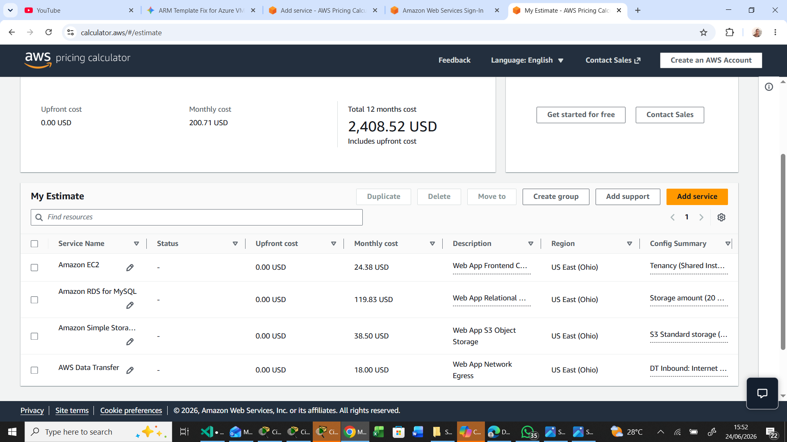
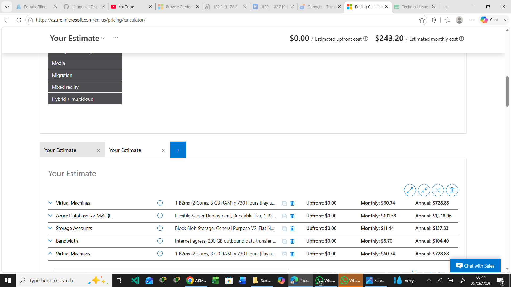

# Azure-vs-AWS-Cost-Comparison-Learning-Program
# Cloud Infrastructure TCO Comparison Project

##  Verified Architecture Estimation Links
* **AWS Pricing Calculator Estimate:** [View Completed AWS Estimate](https://calculator.aws/#/estimate?id=63d3f90d031e118865314669f280c0e712b2bf43)
* **Azure Pricing Calculator Estimate:** [View Completed Azure Estimate](https://azure.com/e/5cfdf7af35c5461cab8eda01710af50f)

---

# Cloud TCO Comparison Report: 3-Tier Production Web Application

This official engineering and comparison report summarizes the complete cost profile, architectural choices, and structural differences discovered while modeling our application across AWS and Microsoft Azure.

---

## 1. Application Specifications & Architectural Baseline (Task 1)
The baseline workload models a standard 3-tier monolithic web application architecture. To establish an exact comparison, identical performance metrics were mirrored on both clouds within the **US East (N. Virginia / US East 1)** regions:

* **Compute Tier:** 2 vCPUs, 8 GB RAM (running standard operational configurations).
* **Database Tier:** Managed MySQL Engine with 2 vCPUs, 8 GB RAM, and **20 GB** dedicated storage space.
* **Object Storage Tier:** **500 GB** allocated capacity for assets, backups, and user uploads.
* **Network Capacity (Egress):** **200 GB** per month of standard data transfer routed out to the public internet.

---

## 2. Cloud Cost Calculation Summaries (Task 2 & Task 3)
The calculations reflect standard configurations sourced across both localized cost planning sessions.

### AWS Infrastructure Estimate (Task 2)
* **Compute Instance (`t4g.large`):** **$24.38 / mo** *(Configured with an ARM64-based Graviton processor, utilizing the AWS 100 GB basic account-wide internet egress allowance).*
* **Managed Database (RDS MySQL):** **$119.83 / mo** *(Configured as Single-AZ deployment tier).*
* **Object Storage (S3 Standard):** **$38.50 / mo** *(500 GB Base storage allocation + transactional operation calculations).*
* **Network Data Transfer Out:** **$18.00 / mo** *(Remaining internet data transfer outside basic allowances).*
* **Total AWS Monthly Commitment:** **$200.71 / mo**

### Azure Infrastructure Estimate & Operating System Variance (Task 3)
* **Azure VM (Linux Baseline):** **$60.74 / mo** *(2 vCPUs, 8 GiB RAM Standard_B2ms configuration).*
* **Azure VM (Windows Server - Pay-As-You-Go):** **$121.18 / mo** *(Standard retail pricing with software licensing overlays included).*
* **Azure VM (Windows Server + Azure Hybrid Benefit):** **$60.74 / mo** *(Waives OS licensing overhead entirely by leveraging active on-premises Windows Server core assets with Software Assurance).*
* **Managed Database (Azure DB for MySQL):** **$101.58 / mo** *(Flexible Server tier running Locally Redundant Storage [LRS]).*
* **Storage Account (Blob Hot Tier):** **$11.44 / mo** *(500 GB capacity backed by LRS block configurations).*
* **Bandwidth (Internet Egress):** **$8.70 / mo** *(200 GB public routing over Microsoft's Global Network).*
* * Total Azure Stack (Linux Base / Windows with AHB):** **$182.46 / mo**

---

## 3. Financial Comparison & Multi-Zone Network Analysis (Task 4)

| Infrastructure Component | AWS Architecture Component | AWS Monthly Cost | Azure Architecture Component | Azure Monthly Cost |
| :--- | :--- | :--- | :--- | :--- |
| **Compute Server** | EC2 (`t4g.large`) | $24.38 | Virtual Machine (`B2ms`) | $60.74 |
| **Managed DB** | RDS for MySQL | $119.83 | Azure Database for MySQL | $101.58 |
| **Object Storage** | S3 Standard (500 GB) | $38.50 | Storage Account (Blob LRS) | $11.44 |
| **Network Egress** | Data Transfer Out | $18.00 | Bandwidth (Internet Egress) | $8.70 |
| ** TOTALS** | **3-Tier Web Stack** | **$200.71 / mo** | **3-Tier Web Stack** | **$182.46 / mo** |

### Networking Analysis: Inter-Zone Data Transfer Fees
When scaling an application out across multiple **Availability Zones (AZ)** for high availability, the network fee structures diverge significantly:
* **AWS Inter-Zone Fee Strategy:** AWS charges a bidirectional fee of **$0.01 per GB** for data traversing Availability Zone boundaries within the same region. This implies that if your application shifts high volumes of internal data across zones, it accumulates **$0.02 per GB round-trip** ($0.01 out, $0.01 in).
* **Azure Inter-Zone Fee Strategy:** Azure does not charge for internal data traversing Availability Zones within the same region (**$0.00 per GB**). Internal availability zone traffic within a regional boundary is fully covered under the base provider network.

---

## 4. Platform Discounting Mechanisms (Task 5)
To move beyond baseline Pay-As-You-Go pricing, both platforms provide commitment frameworks to secure significant discounts:
* **AWS Savings Plans:** Requires an hourly spend commitment for a 1-year or 3-year term. *Compute Savings Plans* are extremely flexible, automatically applying discounts across instance families, regions, and even container workloads (Fargate/Lambda).
* **Azure Reserved Instances (RIs):** Requires a commitment to a specific Virtual Machine type, size, and designated region for a 1-year or 3-year block. Azure provides *Instance Size Flexibility* within the same VM family lines.

---

## 5. Architectural Scenarios & Optimization Strategies (Task 6)

### Strategic Cloud Recommendations
* **When Azure is Most Cost-Effective:** Azure provides clear economic advantages for **storage-heavy workloads** (Blob storage is roughly 70% less expensive than S3 Standard in this tier) and apps that leverage **Microsoft software ecosystems** via the Azure Hybrid Benefit.
* **When AWS is Most Cost-Effective:** AWS dominates in **compute efficiency** when workloads are adapted to **ARM64 Graviton processors**, lowering application hosting base layers below standard general-purpose cloud profiles.

### Two Cost-Optimization Strategies for the Infrastructure
1.  **Enforce S3 / Blob Lifecycle Management Tiers:** Configure automated lifecycle rules on the object storage layer to move files unaccessed for more than 30 days out of Standard/Hot storage tiers directly into AWS S3 Standard-IA or Azure Cool/Archive Blob tiers, cutting cold storage baseline costs by over 50%.
2.  **Transition Compute Workloads to Commitment Frameworks:** Transition the compute and managed database tiers from a raw Pay-As-You-Go profile onto a 1-Year No-Upfront AWS Savings Plan or Azure Reserved Instance to instantly strip 30% to 40% off the ongoing operational expenses.

---

## 6. Final Comparison Summary & Cost-Effectiveness Report (Task 6 Evaluation)
* **The Winner:** **Microsoft Azure** serves as the more cost-effective provider for the baseline Pay-As-You-Go architecture by a variance of **$18.25 per month** ($182.46 vs $200.71). 
* **Key Cost Driver:** While AWS achieved an aggressive compute rate via its Graviton architecture ($24.38 vs $60.74), Microsoft Azure completely reclaimed the financial advantage on its managed database pricing and massive price cuts within object storage ($11.44 vs $38.50) and network out-of-boundary routing configurations ($8.70 vs $18.00). 

---

##  Configured Pricing Calculator Verifications

### AWS Pricing Calculator Baseline
The screenshot below verifies the configured AWS compute architecture (`t4g.large`), managed database instance layer, object storage limits, and outbound data egress routing.

---

### Azure Pricing Calculator Baseline
The screenshots below verify the equivalent Azure architecture layout (`Standard_B2ms`), matching managed MySQL server settings, localized Blob LRS configurations, and the Windows Server scenario using the active Azure Hybrid Benefit.

300-Word Business Justification Summary
# Cloud Provider Choice & Business Justification

Selecting between AWS and Microsoft Azure for this architecture depends heavily on an enterprise's underlying operational framework, existing software investments, and strategic growth plans. 

### Scenario A: The Microsoft-Centric Enterprise (Azure Optimization)
For an established enterprise deeply integrated into the Microsoft ecosystem, Azure is the strategically sound choice. The financial data highlights that Azure delivers a lower Pay-As-You-Go baseline ($182.46 vs $200.71), driven by significantly cheaper object storage tiers and predictable networking rules. More importantly, Task 3 highlights the impact of the Azure Hybrid Benefit (AHB). If the business already holds on-premises Windows Server or SQL Server licenses under active Software Assurance, AHB allows them to reuse those assets in the cloud. This completely eliminates the retail OS licensing premium on Virtual Machines, reducing Windows hosting costs by nearly 50% to match Linux hardware pricing ($60.74/mo). Combining this with Azure Reserved Instances creates an incredibly cost-effective ecosystem for corporate workloads.

### Scenario B: The Linux-Based Startup (AWS Optimization)
Conversely, for an agile, open-source startup utilizing a Linux-based architecture, AWS offers an unmatched operational advantage. Although the initial sticker price appears higher due to unoptimized storage baselines, AWS dominates heavily at the raw compute efficiency layer. By selecting ARM64-based Graviton processor instances (t4g.large), AWS slashed the compute tier down to an aggressive $24.38/mo—massively outperforming Azure's general-purpose B-series hardware ($60.74/mo). For a startup whose primary scaling driver is high-density microservices or pure compute nodes rather than massive archival data, AWS provides a superior performance-to-cost ratio. When combined with Compute Savings Plans, the startup secures immense flexibility to shift regions, instances, or transition into serverless architectures seamlessly as product demands evolve.
